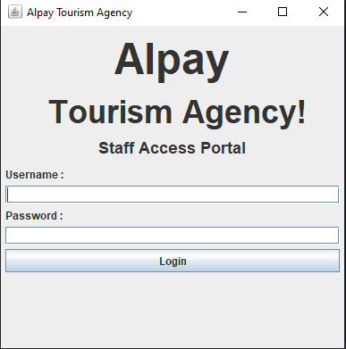
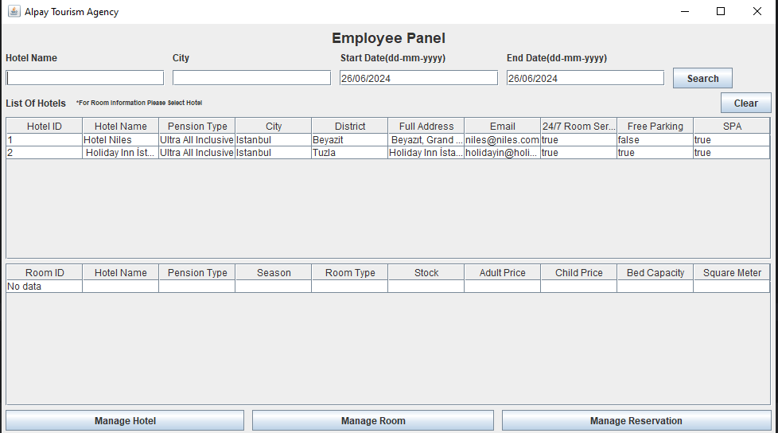
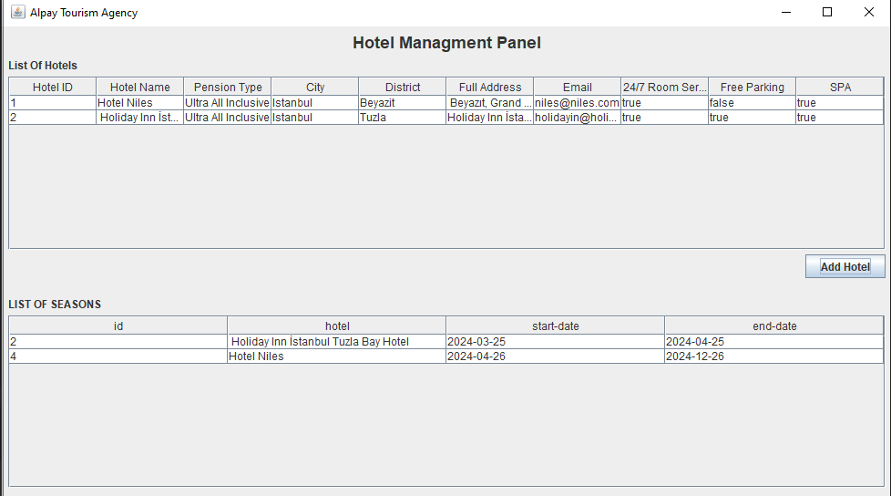
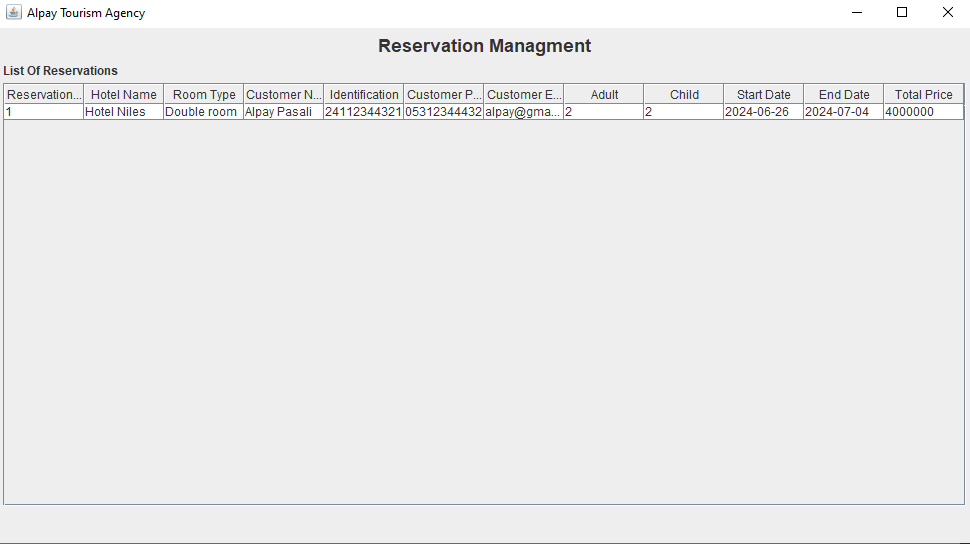
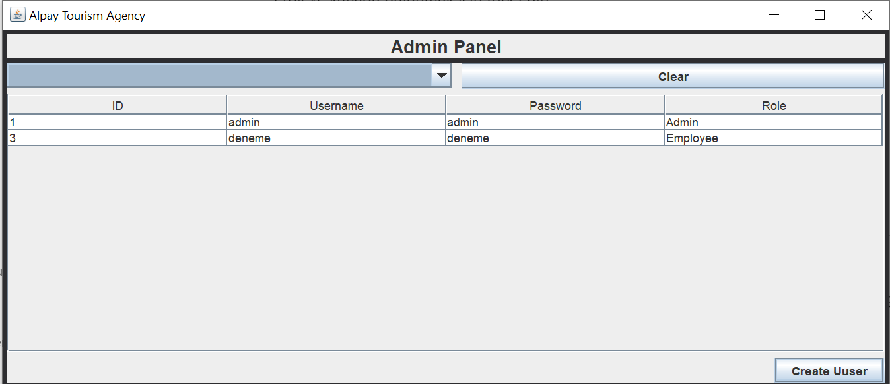

# Turizm Acente Sistemi

Bu proje, Patika Turizm Acentesi için geliştirilen bir otel yönetim ve rezervasyon sistemi yazılımıdır. Sistem, acente çalışanlarının otelleri yönetmelerini, odaları fiyatlandırmalarını ve müşteri rezervasyonlarını kolayca yapabilmelerini sağlar.

## Özellikler
* **Kullanıcı Yönetimi** : Admin kullanıcıları ekleyebilir, düzenleyebilir ve silebilir. Acente çalışanları (personel) yetkilendirilebilir.
* **Otel Yönetimi** : Acentenin anlaşmalı olduğu otellerin yönetimi, otel bilgileri ve özelliklerinin kaydedilmesi.
* **Oda Yönetimi** : Otel odalarının listelenmesi, ekleme ve rezervasyon işlemleri.
* **Dönem Yönetimi** : Otellerin dönemsel fiyatlandırma yönetimi.
* **Fiyat Yönetimi** : Oda tiplerine ve dönemlere göre fiyatlandırma.
* **Otel Arama** : Şehir, otel adı ve tarih aralığına göre oda arama.
* **Rezervasyon İşlemleri** : Müşteri rezervasyonlarının yönetimi, fiyat hesaplama ve stok güncelleme.

## Teknik Detaylar
* **Veritabanı** : PostgreSQL kullanılarak oluşturulan tablolar (user, hotel, season, pension_type, room, reservation).
* **Arayüz** : JavaFX kullanılarak GUI tasarımı yapılmıştır.

## Kullanım
1. Admin olarak giriş yaparak kullanıcılar ekleyin ve yetkileri düzenleyin.
2. Acente çalışanı olarak otelleri ve odaları yönetin, fiyatları ayarlayın ve rezervasyonları yapın.

## Ekran Görüntüleri
**Employee Panel** 

**Admin Panel**

